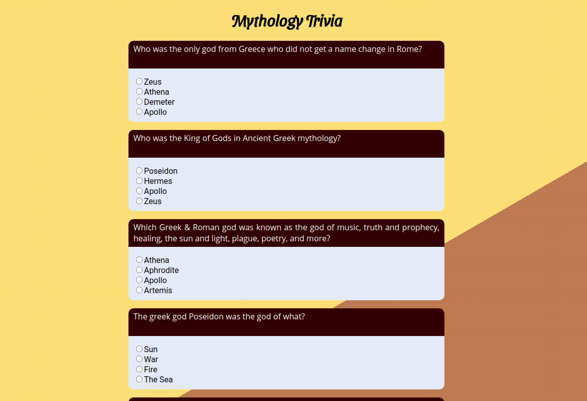

# Trivia - the-quizz
I realised this mini-project on December 14th, 2020, during my junior webdev training at BeCode.  
## About  
This project's aim is using [Open Trivia Database's API](https://opentdb.com/api_config.php) to create a simple quiz using JS to retrieve data.  

## Language  
- JavaScript  

## What have I learned?
I learned how to use AJAX requests to fetch content on the API and display it.  
I also ran into an encoding issue with characters that should've been escaped: I used a function to decode strings from base64 to unicode to arrange this issue.  

## Known Issues
- Clicking multiple times on answers of the same question will update the score. It means you can get more than -1 or +1 points per question.  
- There is an issue with the div displaying the score: it appears even when there is nothing to display.  

## Things I want to add  
- Category, difficulty and question count selector.  
- A "menu" page to display it all.  
- A beter way to display the score.  
- Change a bit the way questions and answers are displayed.  

## Appearance  
Here's the current appearance of the page.
  
You can test the trivia [here](https://aurorevanhoorebeke.github.io/the-quizz/).